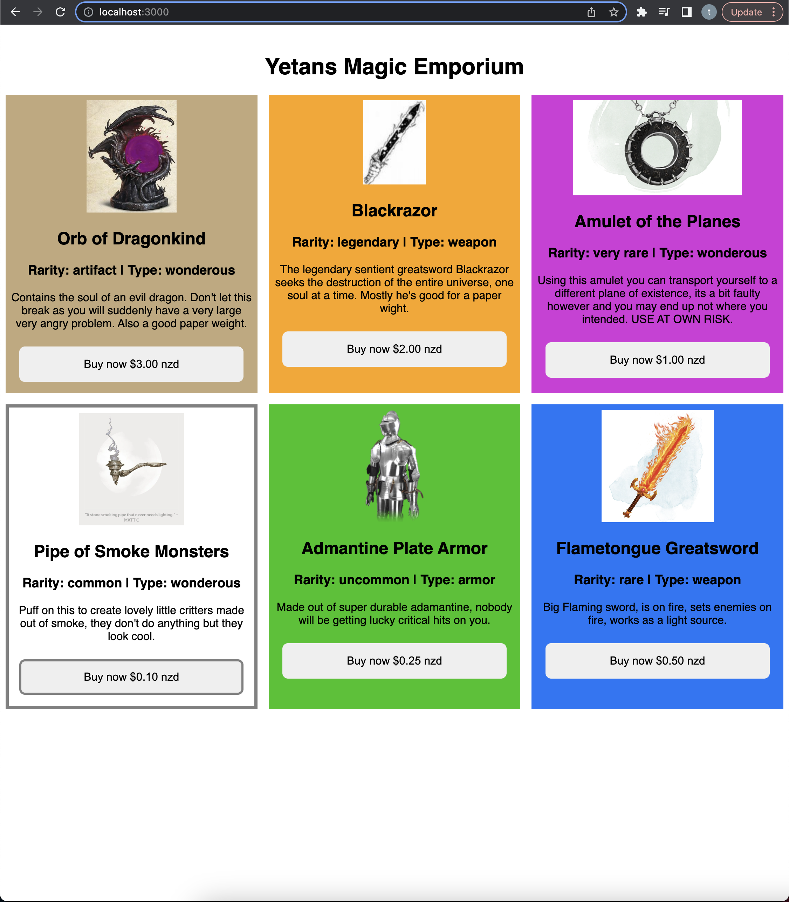

# 01 Project - Online Shop - Yetan's Magical Eporium

This an online shop that sells magical items from the table-top roleplaying game dungeons and dragons fifth-edition. The website uses rarity, and type to distinguish between products. The website currently runs in nzd and formats prices from the api into nzd.

This website grabs information from an api (Stripe) to display relevant information, and uses stripe to manage the sale and information of items. The api is hosted by Begin.

The website is currently deployed with render [here](https://yetans-magic-emporium.onrender.com).

## Basic Gist of Folders
Within src/App.js
* [Components](src/Components) handles the individual items with products of products
* [services](src/services) handles the checkout function in regards to Stripe
* [Utils](src/utils) contains the function that converts the api supplied price into nzd

## Dependencies 

This project uses the following systems to work properly:

* [Stripe](https://stripe.com/en-nz) 
* [Begin](https://begin.com/)
* [React](https://react.dev/)
* [Render](https://render.com/)

### Prerequisites

- [node](https://nodejs.org/en)

## Local Developement
1. Run `npm install`
3. Run `npm start` to start the developement server
3. Open src/App.js to get started

## Deployed Applications

 * [Begin](https://ci.begin.com/apps/89dra7wdd6mem3/environments)

 Come here to add new products relevant metadata is rarity(used to color the items, +filter and sort)[common, uncommon, rare, very rare, legendary, artifact] and type(for sort and filter 'not implemented yet')[weapon, armor, wonderous]
 * [Stripe Products Dashboard](https://dashboard.stripe.com/test/products?active=true)

### Link to the deployed website (Yetan's Magic Emporium)
 * [Website Render](https://yetans-magic-emporium.onrender.com)

## TODOS
 
 - [ ] implement filterBy, sortBy, and search
 currently the website has no filterby or sort by functionality, need to create components for each and create the html to display the relevant selector fields.

 - [ ] implement collapsibles for each product
 website needs each product to be a collapsible element to save on space, we only have 6 items total but there are hundreds of magical items within dnd which means we need to display as much content as possible in the smallest amount of space

 - [ ] update css to look nicer
 currently css works and is functionally great in terms of accessibility and reliability, but the website looks god-awful.

